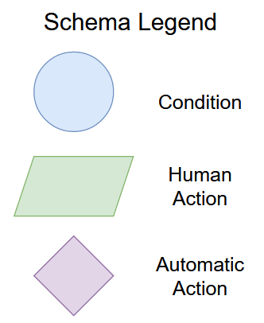
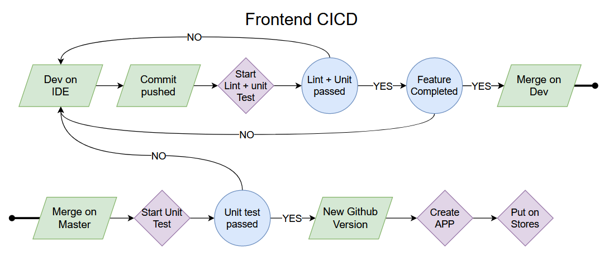
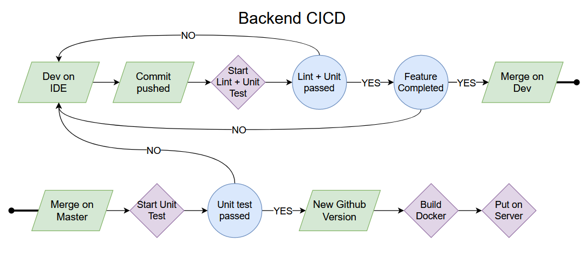

# Projet DEVOPS groupe 4

-----------

<br>
<br>
<br>

## Membres du groupe:
- Gaëtan Salvi
- Cyril Hansse
- ~~Adelin Casez~~ a quitté l'école

<br>
<br>
<br>

-----------

<br>
<br>
<br>

## Premiers Objectifs: 



<br>



<br>



<br>
<br>
<br>

-----------

<br>
<br>
<br>

## Github du serveur
[](https://github.com/Jaetan-Salvetat/status-backend/tree/docker)

## Github de l'application mobile
[](https://github.com/Jaetan-Salvetat/status-android.git)

<br>
<br>
<br>

-----------

<br>
<br>
<br>

## Contenu du CICD des applications mobiles: 

- Du coté de la création des CI/CD avec github, nous n'avons pas pas rencontré de problèmes particulier, juste un manque de temps.

- Dans nos objectifs initiaux, nous avions prévu des github actions au moment de change merge pour lancer les tests unitaires, et un linter (pour l'application Android, iOS et node.js).

- nous n'avons ni eu le temps de rajouter le lancement des tests unitaires sur les 3 technos, ni de lancer le linter swift pour l'application iOS

<br>
<br>
<br>

-----------

<br>
<br>
<br>

## Avancement du docker-compose: 

### docker-compose.yml
```docker
version: '3.8'

services:
  mysqldb:
    image: mysql:5.7
    restart: unless-stopped
    environment:
      MYSQL_ROOT_PASSWORD: 
      MYSQL_ROOT_USER: root
      MYSQL_PASSWORD: Passw0rd
      MYSQL_DATABASE: status
      MYSQL_ALLOW_EMPTY_PASSWORD: "yes"
      MYSQL_USER: user
    ports:
      - "6033:3306"
    volumes:
      - db:/var/lib/mysql

  phpmyadmin:
    image: phpmyadmin/phpmyadmin
    container_name: pma
    links:
      - mysqldb
    environment:
      PMA_HOST: mysqldb
      PMA_PORT: 3306
      PMA_ARBITRARY: 1
    restart: always
    ports:
      - 8081:80

  app:
    depends_on:
      - mysqldb
    build: ../status-backend
    environment:
      PORT: 3000
      SQL_DATABASE_URL: mysql://root:@localhost:3306/status
    restart: unless-stopped
    ports:
      - 3000:3000
    stdin_open: true
    tty: true
volumes: 
  db:
```

- Actuellement Nous n'avons pas eu le temps de résoudre le bug qui empêche le serveur Node d'utiliser la base de donnée.

- Cependant, chaque élément fonctionne séparément.

- Il est possible de faire: `docker-compose up` pour créer et lancer en local les containers.